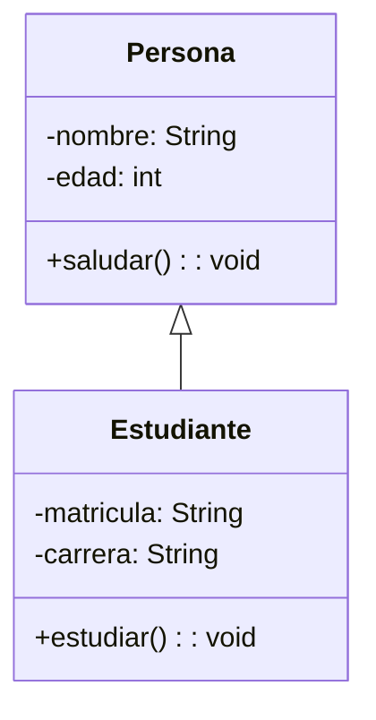

```mermaid
classDiagram
    class Persona {
        -nombre: String
        -edad: int
        +saludar(): void
    }

    class Estudiante {
        -matricula: String
        -carrera: String
        +estudiar(): void
    }

    Persona <|-- Estudiante
```
 