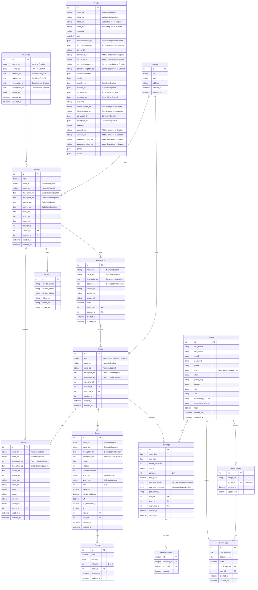

```mermaid
erDiagram
    Internships {
        int id PK
        string name_en "Name in English"
        string name_es "Name in Spanish"
        text description_en "Description in English"
        text description_es "Description in Spanish"
        string subtitle_es
        string subtitle_en
        string image_url
        boolean state
        int station_id FK
        int country_id FK
        datetime created_at
        datetime updated_at
    }

    Instructors {
        int id PK
        string name_en "Name in English"
        string name_es "Name in Spanish"
        text description_en "Description in English"
        text description_es "Description in Spanish"
        text subtitle_es
        text subtitle_en
        string video_es
        string video_en
        string email
        string phone
        string linkedin
        string image_url
        int station_id FK
        datetime created_at
        datetime updated_at
    }

    Stays {
        int id PK
        string type "Hotel, Casa Familiar, Camping"
        string name_en "Name in English"
        string name_es "Name in Spanish"
        text description_en "Description in English"
        text description_es "Description in Spanish"
        int internship_id FK
        int country_id FK
        int instructor_id FK
        int location_id FK
        datetime created_at
        datetime updated_at
    }

    Rooms {
        int id PK
        string name_en "Name in English"
        string name_es "Name in Spanish"
        text description_en "Description in English"
        text description_es "Description in Spanish"
        json images
        int nRooms
        int nRoomsAvailable
        string type_bed "single/double"
        string type_room "individual/shared"
        int stars "1 to 5"
        boolean breakfast
        boolean private_bathroom
        boolean wifi
        boolean air_conditioning
        boolean tv
        int stay_id FK
        int price_id FK
        datetime created_at
        datetime updated_at
    }

    Stations {
        int id PK
        boolean state
        string name_en "Name in English"
        string name_es "Name in Spanish"
        text description_en "Description in English"
        text description_es "Description in Spanish"
        text subtitle_en "Subtitle in English"
        text subtitle_es "Subtitle in Spanish"
        text video_en
        text video_es
        text image_url
        int director_id FK
        int country_id FK
        int location_id FK
        datetime created_at
        datetime updated_at
    }

    Countries {
        int id PK
        string name_en "Name in English"
        string name_es "Name in Spanish"
        text subtitle_en "Subtitle in English"
        text subtitle_es "Subtitle in Spanish"
        text description_en "Description in English"
        text description_es "Description in Spanish"
        string image_url
        datetime created_at
        datetime updated_at
    }

    Article {
        int id PK
        string title1_en "Main title in English"
        string title1_es "Main title in Spanish"
        string title2_en "Secondary title in English"
        string title2_es "Secondary title in Spanish"
        string category
        dateOnly date
        json shortdescription_en "Short description in English"
        json shortdescription_es "Short description in Spanish"
        string bannerUrl
        string bannerAlt_en "Alt text for banner in English"
        string bannerAlt_es "Alt text for banner in Spanish"
        string bannerdescription_en "Banner description in English"
        string bannerdescription_es "Banner description in Spanish"
        json articlesocialmedia
        json media
        json subtitle_en "Subtitle in English"
        json subtitle_es "Subtitle in Spanish"
        json audiotitle_en "Audio title in English"
        json audiotitle_es "Audio title in Spanish"
        string audioUrl
        string titledescription_en "Title description in English"
        string titledescription_es "Title description in Spanish"
        json paragraph_en "Content in English"
        json paragraph_es "Content in Spanish"
        string videoUrl
        string videoAlt_en "Alt text for video in English"
        string videoAlt_es "Alt text for video in Spanish"
        string videodescription_en "Video description in English"
        string videodescription_es "Video description in Spanish"
        json gallery
        json iframe
    }

    Director {
        int id PK
        string director_name
        string director_email
        string director_phone
        string video_es
        string video_en
        string image_url
    }

    Bookings {
        int id PK
        date start_date
        date end_date
        int rooms_reserved
        boolean status
        int duration "2, 4"
        decimal total_price
        string payment_status "pending, completed, failed"
        string payment_reference "ID generado por PayPal"
        string pdf_itinerary
        int stay_id FK
        int user_id FK
        int internship_id FK
        datetime created_at
        datetime updated_at
    }

    Booking_Room {
        integer id PK
        integer booking_id FK
        integer room_id FK
        integer quantity
    }

    Users {
        int id PK
        string first_name
        string last_name
        string email
        string password
        string phone
        string role "client, admin, superAdmin"
        string state
        string profile_img
        string country
        string city
        string zip
        string emergency_contact
        string emergency_phone
        boolean login
        datetime created_at
        datetime updated_at
    }

    Publications {
        int id PK
        string image_url
        int author_id FK "Table User"
        datetime created_at
        datetime updated_at
    }

    Comments {
        int id PK
        text description_es
        text description_en
        boolean state
        int publication_id FK
        int user_id FK
        datetime created_at
        datetime updated_at
    }

    Prices {
        int id PK
        decimal price
        string currency
        int nWeeks "2 or 4"
        int room_id FK
        datetime created_at
        datetime updated_at
    }

    Location {
        int id PK
        string city
        string gps
        string address
        datetime created_at
        datetime updated_at
    }

    Countries ||--o{ Stations : "has"
    Stations ||--o{ Internships : "offers"
    Stations ||--|| Director : "has"
    Stations ||--o{ Instructors : "employs"
    Internships ||--o{ Stays : "includes"
    Stays ||--o{ Rooms : "has"
    Stays ||--o{ Bookings : "receives"
    Users ||--o{ Bookings : "makes"
    Bookings ||--o{ Booking_Room : "has many"
    Stays ||--o{ Instructors : "has"
    Users ||--o{ Comments : "writes"
    Users ||--o{ Publications : "authors"
    Publications ||--o{ Comments : "has"
    Rooms ||--o{ Prices : "has"
    Location ||--o{ Stations : "has"
    Location ||--o{ Stays : "has"
```
